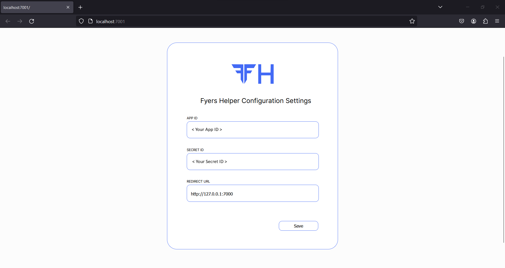
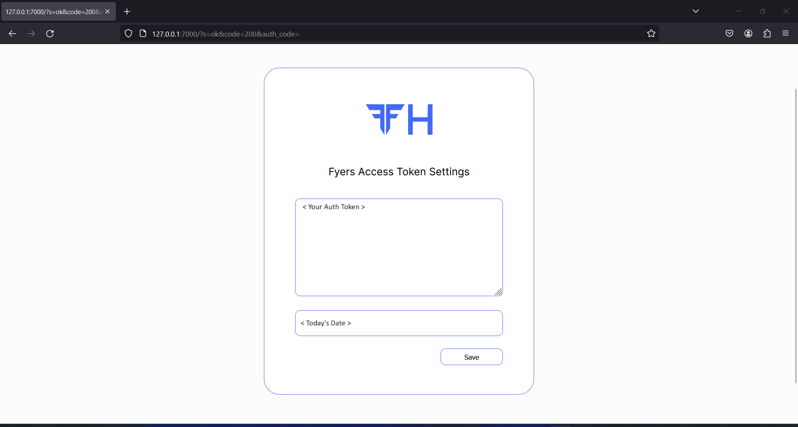

<div align="center">
    </img>
</div>

---

Welcome to the Fyers API Helper, a Python library designed to streamline your interaction with the Fyers API effortlessly. This library is offered freely to the public under the MIT open-source license.

## Features

- **Graphical interface for credential management**: Fyers API Helper provides an intuitive graphical interface hosted locally. It allows you to easily store and retrieve credentials and access tokens with convenience.

- **Semi-automatic access token generation**: Enjoy a straightforward semi-automatic process for generating and validating access tokens.

- **Symbol search with Text User Interface (TUI)**: Easily search for symbols using a clean Text User Interface based on their names.

- **Clean Historical Data function**: Access a user-friendly and unlimited (exercise caution and adhere to Fyers API limits) historical data gathering feature.

## Installation Guide

### Step 1: Fyers Account Setup

- Log in to your Fyers account and visit the [Fyers Dashboard](https://myapi.fyers.in/dashboard).

### Step 2: Create a New Fyers App

- Create a new Fyers App and set the Redirect URL to `127.0.0.1:7000` (Ensure data access for optimal performance).


### Step 3: Install the Library

- Open your terminal and run the following command:

```bash
pip install fyers-api-helper
```

Make sure Microsoft Visual Studio C++ 14.0 or above is installed.

### Step 4: Configuration

- In the terminal, execute:

```bash
fyersh config
```

This will open a new browser window to save configuration details.



After saving, press Ctrl-C to continue.

### Step 5: Generate Access Token

- For generating a new access token, execute the following command in the terminal:

```bash
fyersh access
```



Enter your login details and press Save to store the access token.

For more details, refer to the [documentation](https://fyers-api-helper.readthedocs.io/en/latest/#/).

## Contribution Guidelines

We welcome contributions to the Fyers API Helper! If you wish to contribute, please follow these guidelines:

1. Fork the repository and create your branch from `main`.
2. Make sure your code adheres to the existing style and conventions.
3. Ensure that your commits are clear and concise.
4. Open a pull request, describing the changes you made and why.

## Disclaimer

Fyers API Helper is not affiliated with or endorsed by Fyers. All trademarks and logos belong to their respective owners. Trading and investing in the stock market involve risk, and it is essential to conduct thorough research and seek professional advice. The authors and contributors of Fyers API Helper are not responsible for any financial losses or other damages resulting from the use of this library. Use it at your own risk.