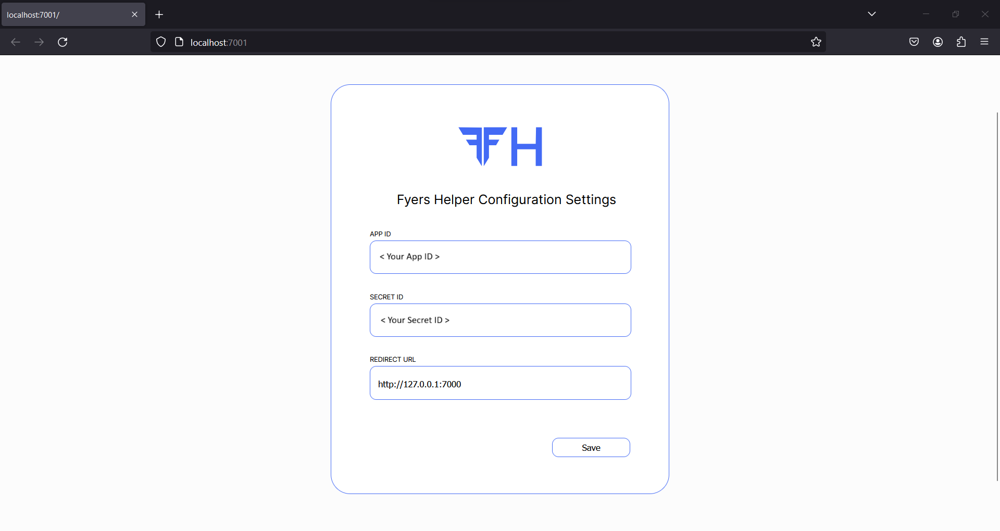
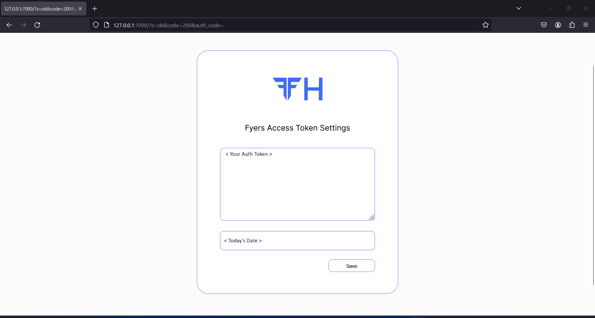

----

# Fyers API Helper

Fyers API Helper is a Python library designed to simplify the interaction with the Fyers API.

This code is free and publicly available under the MIT open source license!

## Features

- **Graphical interface for storing credentials**: Fyers API Helper provides an easy to use graphical interface served locally to store and retrieve credentials and access tokens.

- **Semi-automatic access token generator**: Provides easy semi-automatic Access token generation and validation process.

- **Symbol search**: Provides easy Text User Interface for searching appropriate symbols based on there names.

- **Clean Historical Data function**: Provides a easy to use and unlimited (use with caution and respect Fyers API Limit) historical data gathering.

## Installation Guide

- Step 1: Login into Fyers Account and visit [Fyers Dashboard](https://myapi.fyers.in/dashboard)

- Step 2: Create a new Fyers App and set Redirect URL to `127.0.0.1:7000` (Ensure access to data for best use)


- Step 3: Open terminal and write 
```
pip install fyers-api-helper
``` 
(ensure Microsoft Visual Studio C++ 14.0 or above is installed)

- Step 4: In terminal execute 
```
fyersh config
```
 It will open a new browser window to save configuration details.



After saving Press Ctrl-C to continue.

- Step 5: For generating new access token in terminal execute
```
fyersh access
```


Enter your login details and press Save to save the access token.

For more details visit docs.