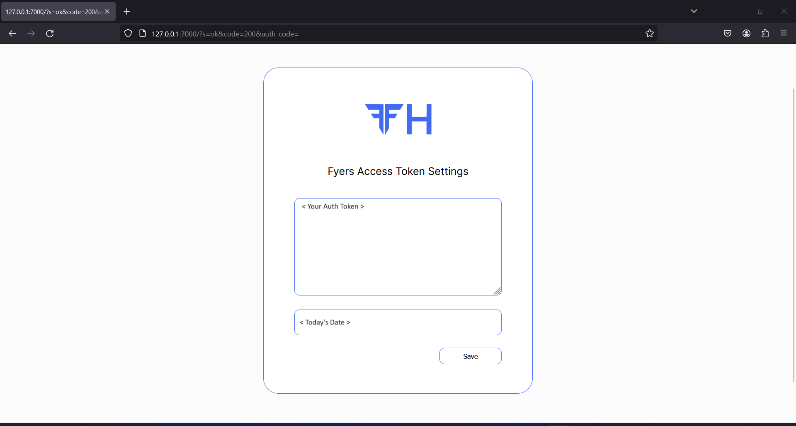

## Access Token Settings

```bash
$ fyersh access -h
usage: fyersh access [-h] [-v] [-p] [-s TOKEN AUTODATE]

options:
  -h, --help            show this help message and exit
  -v, --is-valid        Check if the access token is valid
  -p, --print           Print the access token
  -s TOKEN AUTODATE, --set TOKEN AUTODATE
                        Set access token manually
```
Fyers API Helper Access Token Setting is used to generate and store the Access Token generated by Fyers API locally. It is stored in the home directory of the system i.e. ```C:\Users\yourusername\``` in Windows and ```~``` in Linux based systems. Access Token file is autogenerated with the name ```.fyers_access.json```. There are two method for setting Fyers Access Token:

----
### 1. Graphical Interface

Step 1: In your terminal enter

```
$ fyersh access
```
It will start a web browser instance which will prompt you to official Fyers Login Page where you will be asked to login into your Fyers Account.

Step 2: Access Token Page



!> The text shown in text box is Auth Token not Access Token. Auth Token is used to generate access token.

Step 3: Save and press Ctrl-C in the terminal to end the web browser instance.

### 2. Through Command line

We can directly set our access token file through command line using ```-s``` .

```bash
$ fyersh access -s ACCESS_TOKEN <Your Access Token>
$ fyersh access -s DATE <Date>
```

!> <Date> should be in %d-%m-%Y format of strftime formats. Refer [Strftime cheetsheet](https://strftime.org/) for more details.

----

### Viewing the saved access token

The command given below prints out the current configuration on the terminal.

```bash
$ fyersh access -p
```

The output is of the format:

```bash
$ fyersh access -p

ACCESS TOKEN:   <Your Access Token>
DATE:           <Today's Date>
```

### Deleting the access token file

To remove the access token file simply delete the saved ```.fyers_access.json``` in your respective home directory as mentioned above.

